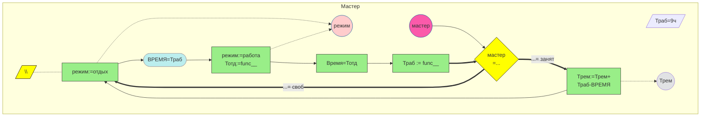
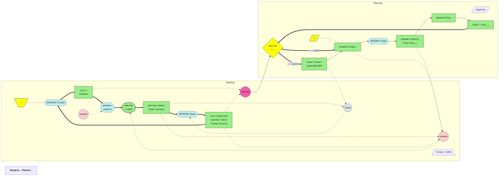

```mermaid
flowchart LR

classDef cond fill:#bee,stroke:#aaa,stroke-width:1px;
classDef state fill:#9e8,stroke:#333,stroke-width:1px;
classDef params fill:#fcc,stroke:#159,stroke-width:1px;


subgraph Мастер
direction LR
h21[/Траб=9ч/]
p1[/\\/] -.- h11[режим:=отдых]
h11 -.-> par2((режим))
h11 --> h12([ВРЕМЯ=Траб])
h12 --> h13[режим:=работа<br>Тотд:=func__]
h13 -.-> par2
click par2 "переход для Мастера" _blank
h13 --> h15[Время=Тотд]
h15 --> h16[Траб := func__]
par3((мастер)) --> h19
h16 ==> h19{"мастер<br>=..."};
h19 ==>|"...= занят"| h20["Tрем:=Трем+<br>Траб-ВРЕМЯ"];
h19 ==>|"...= своб"| h11;
h20 --> h11
h20 -.-> par4((Трем))

class h11,h13,h15,h16,h20 state;
class h12,h6,h8 cond;
class par2,par3 params;
style p1 fill:#ff0,stroke:#100,stroke-width:1px;
style h19 fill:#ff0,stroke:#100,stroke-width:1px;
style par3 fill:#fb5aaa
style par4 fill:#e1e2e4
end
```

Операторно-параметрическая схема взаимодействия

```mermaid
flowchart LR

classDef cond fill:#bee,stroke:#aaa,stroke-width:1px;
classDef state fill:#9e8,stroke:#333,stroke-width:1px;
classDef params fill:#fcc,stroke:#159,stroke-width:1px;

subgraph Прибор
%% задаем структуру трека
 h1(["BPEMЯ=Tслом"]) ==> h2["сост:=<br>сломан"];
 h2 ==> h3(["режим=<br>работа"]);
 h3 ==> h4(["мастер<br>=своб"]);
 h4 ==> h5["мастер:=занят<br>Tрем:=funс(x)"];
 h5 ==> h6(["ВРЕМЯ=Трем"]);
 h6 ==> h7["сост:=рабочий<br>мастер:=своб<br>Tслом:=func(x)"];
 h7 ==> h1;
 h2 -.-> par3((сост));
 h7 -.-> par3;
 par1((режим))-.-> h3;
 par2((мастер))-.-> h4;
 h5 -.-> par2;
 h7 -.-> par2;
 h5 -.-> par4((Трем));
 par4 -.-> h6;
 p0[\I/] -.- h1;
 h0[/"Тслом = 100ч"\];
%% задаем раскраску
class h2,h4,h5,h7 state;
class h1,h3,h6,h8 cond;
class par1,par4 params;
style p0 fill:#ff0,stroke:#100,stroke-width:1px;
end

title[<b>Модель _Ремонт_</b>]

subgraph Мастер
direction LR
h21[/Траб=9ч/]
p1[/\\/] -.- h11[режим:=отдых]
h11 -.-> par2((режим))
h11 --> h12([ВРЕМЯ=Траб])
h12 --> h13[режим:=работа<br>Тотд:=func__]
h13 -.-> par2
click par2 "переход для Мастера" _blank
h13 --> h15[Время=Тотд]
h15 --> h16[Траб := func__]
par3((мастер)) --> h19
h16 ==> h19{"мастер<br>=..."};
h19 ==>|"...= занят"| h20["Tрем:=Трем+<br>Траб-ВРЕМЯ"];
h19 ==>|"...= своб"| h11;
h20 --> h11
h20 -.-> par4((Трем))

class h11,h13,h15,h16,h20 state;
class h12,h6,h8 cond;
class par2,par3 params;
style p1 fill:#ff0,stroke:#100,stroke-width:1px;
style h19 fill:#ff0,stroke:#100,stroke-width:1px;
style par3 fill:#fb5aaa
style par4 fill:#e1e2e4
end
```